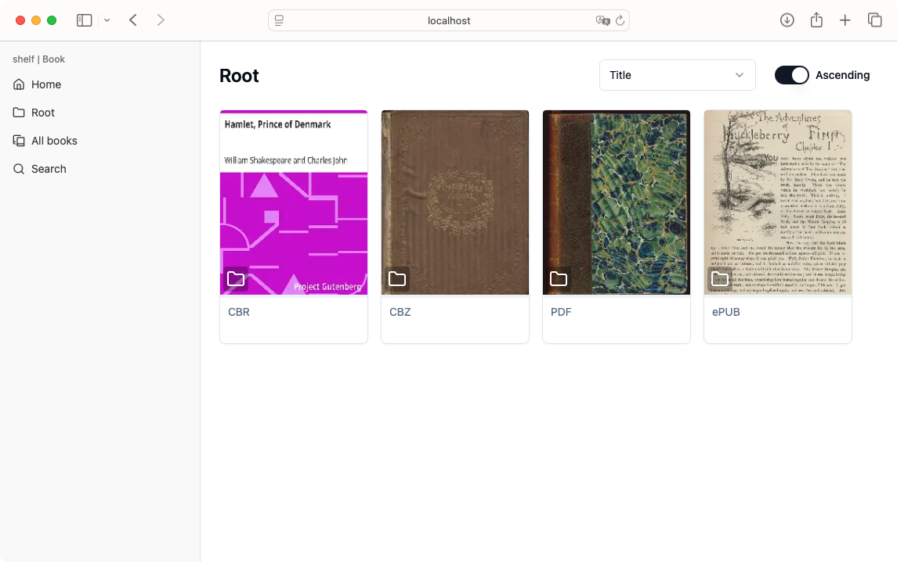
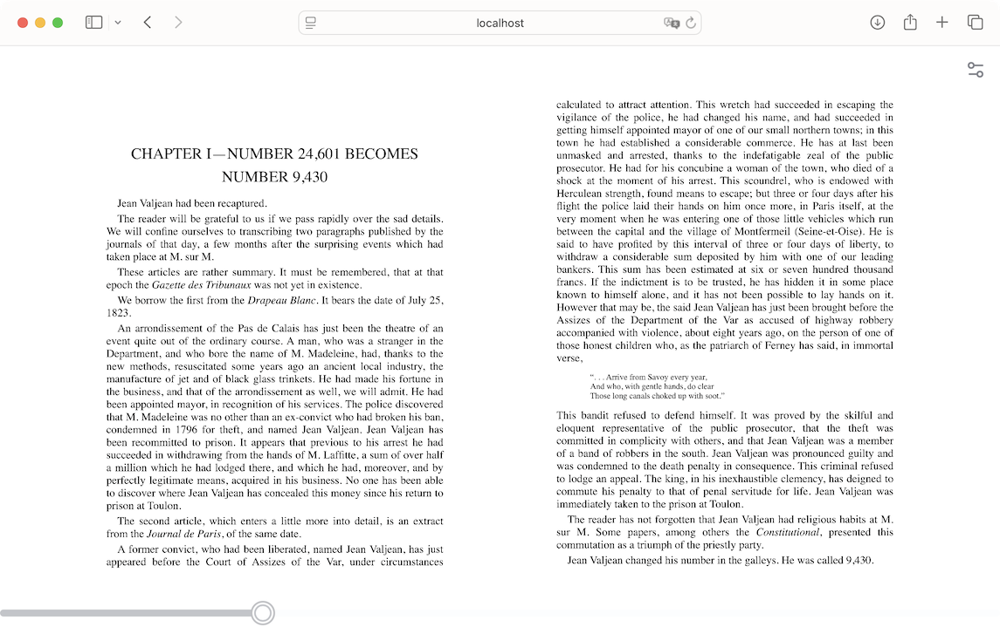
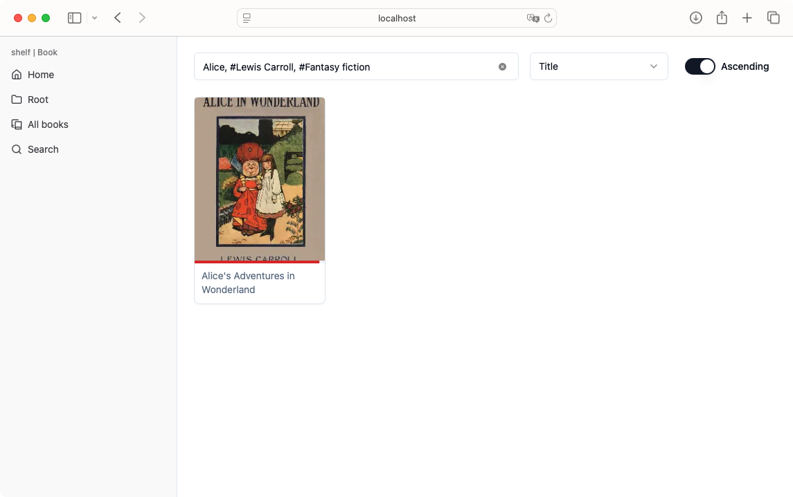

> このリポジトリは [projects-shelf/Book](https://github.com/projects-shelf/Book)（作者: [PepperCat](https://github.com/PepperCat-YamanekoVillage)、MITライセンス）を自宅PCでセルフホストするために取り込んだものです。
> 解説記事: [セルフホストできる軽量な電子書籍配信サーバーをつくった](https://yamanekovillage.com/articles/shelf_book/)

## 自宅PCで動かす（日本語メモ）

前提: Docker と Docker Compose が入っていること。フロントはビルド済み（`front/dist`）なので Bun や Node は不要です。

```shell
git clone <このリポジトリ>
cd test
mkdir books          # ここに PDF / EPUB / CBZ / CBR を置く（サブフォルダ可）
docker compose up -d
```

ブラウザで `http://localhost:50080` を開きます。同じLAN内の他端末からは `http://<PCのIP>:50080` でアクセスできます。

- 起動直後は本のスキャンが走るので、終わるまで応答がないことがあります。
- 本を追加・削除したときはコンテナを再起動するとスキャンし直します（`docker compose restart go`）。
- データベースは `./db`、表紙キャッシュは `./cache` に保存されます。
- 設定は `docker-compose.yml` の環境変数で変更できます。

| 変数 | 既定値 | 内容 |
|------|--------|------|
| `PAGE_SIZE` | 20 | 一覧1ページあたりの表示数 |
| `COVER_SIZE` | 300 | 表紙サムネイルの幅(px) |
| `COVER_QUALITY` | 70 | 表紙JPEGの品質 |

ポートを変えたいときは `docker-compose.yml` の `"50080:80"` の左側を書き換えてください。
PDFはEmbedPDF（pdfium.wasm）でブラウザ側描画されるので、サーバー側の負荷は小さいです。

---

# shelf | Book

### A lightweight ebook server with an intuitive UI

<br>



### Supported Formats

| Format     | Viewer | Extract Cover | Extract Metadata |
|------------|--------|----------------|------------------|
| PDF        | ✅      | ✅             | ✅               |
| EPUB       | ✅      | ✅             | ✅               |
| CBZ        | ✅      | ✅             | ❌               |
| CBR        | ✅      | ✅             | ❌               |

✅ = Supported  △ = Partial Support / Experimental  ❌ = Not Supported

<details>
<summary><strong>Known Bugs</strong></summary>

- Safari: The epubViewer's display area may be reduced.  
- Safari: The epubViewer may become unresponsive.  

</details>

## Quickstart

```shell
git clone https://github.com/projects-shelf/Book.git
cd Book
docker-compose up -d
```

During the initial scan of the books, the server may appear unresponsive. Please wait until the process is finished.

## Features

### Simple viewer



options
  - LtoR / RtoL reading direction
  - No spreads / Odd spreads / Even spreads
  - Font size

### Searchable by title and metadata



Allows prefix search on titles and exact match search on metadata using hashtags (#).

### Lightweight

Built with Go and SQLite, it consumes minimal system resources.

```
CONTAINER ID   NAME                 CPU %     MEM USAGE / LIMIT     MEM %     NET I/O         BLOCK I/O   PIDS
13ac41d1866e   shelf_book_nginx     0.00%     1.91MiB / 3.88GiB    0.05%     209MB / 210MB     11.5MB / 541kB    2
bcebb5552894   shelf_book_go        0.00%     14.57MiB / 3.88GiB   0.37%     706kB / 208MB     111MB / 38.7MB    11
```

Resource consumption during idle periods (on Intel Mac)

## Note

- PDF rendering requires a moderate amount of resources.

## License

Book is licensed under [MIT License](https://github.com/projects-shelf/Book/blob/main/LICENSE).

## Author

Developed by [PepperCat](https://github.com/PepperCat-YamanekoVillage).
